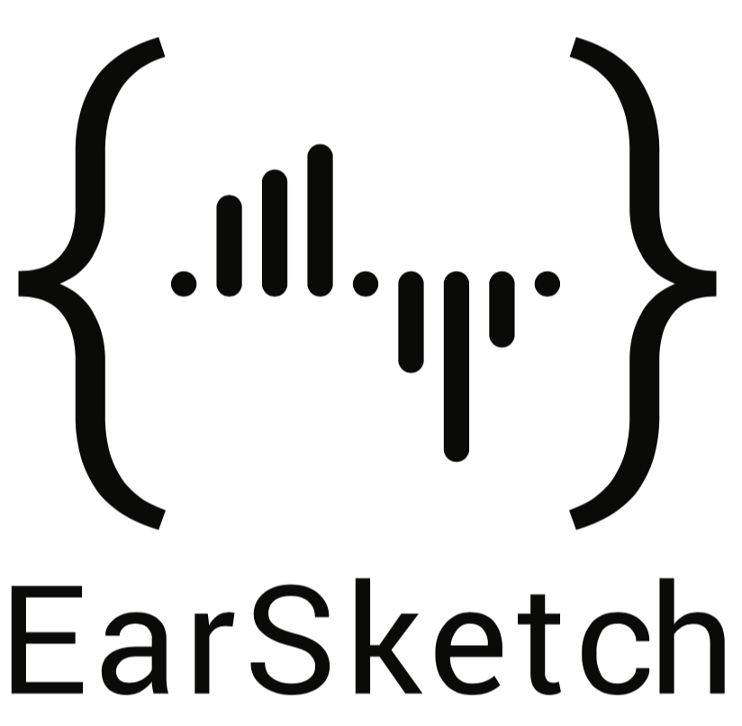
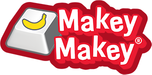

# DubMIX

## Description
DubMIX is a rhythm game that uses EarSketch and LMMS to generate notes based on the beat of the music. EarSketch allows users to learn to make music while using Python/JavaScript to make audio. LMMS is a digital audio workstation that helps create the notes in DubMIX. DubMIX uses Unity to teach about game development concepts in 2D games, like graphical design, scripting in C#, and other programming concepts. This program is intended to increase interest in coding and game development by allowing students the opportunity to explore and learn the fun aspects of code. Our group is part of a program called TAP, Technology Ambassador Program. The goal of TAP is to help spark interest to future students in the IT field as well as promote the IT field to non-IT students.

##  Team Members
* Richard Rodas 😂
* Jin Lee
* Alexis Cochrane ;)

## Publications
  To ADD Later

## Outreach Activities
  To ADD Later

## Technology

**Unity**  
  
Unity is the game engine we designed our Rhythm game with.
>https://unity.com/

**EarSketch**  
  
Earsketch is free online software that makes music based on the code you write.
>https://earsketch.gatech.edu/landing/#/

**Makey-Makey**  
  
Our team also utilized Makey-Makey, a 2D/3d game hardware controller.
>https://makeymakey.com/

## Project Setup
 1. Install Unity and Unity Hub
 2. Install LMMS
 3. Install Visual Studio Code
 4. Open web browser and navigate to the Ear Sketch website
 Operating System: Windows 8 or higher, MacOS
 Programming Language: C# and Python
  
